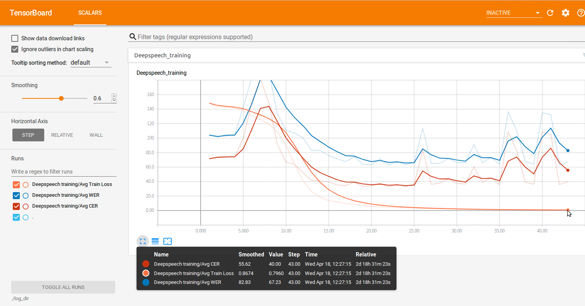

# DeepSpeechVSkaldi
AI Research Engineering on Korean Speech to Text(STT) Engines via Mozilla Deepspeech and Kaldi ASR

## Comming soon with the result of

1. Monophone+Triphone1,2,3+ Deep Neural Network Training and Decoding on Kaldi ASR == Done

2. 20% of total data(GRU based NN. Resulted similar WER of Kaldi ASR in method 1) == Done

3. On-going full data Training as illustrated IMG below

Based on 17GiB of Korean WAVs and TXTs
 

